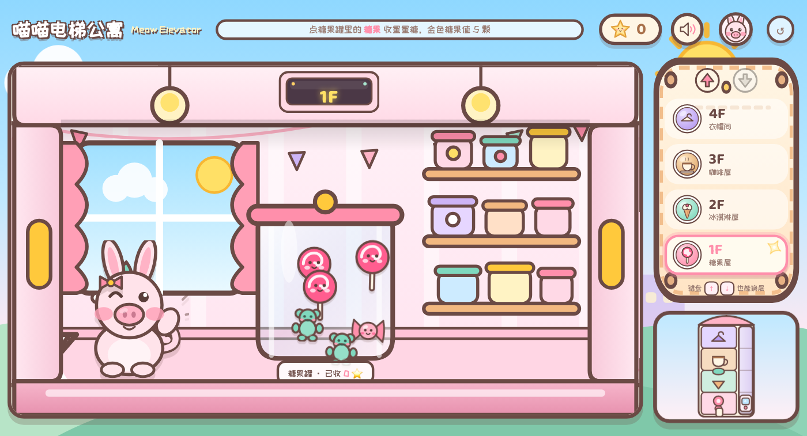
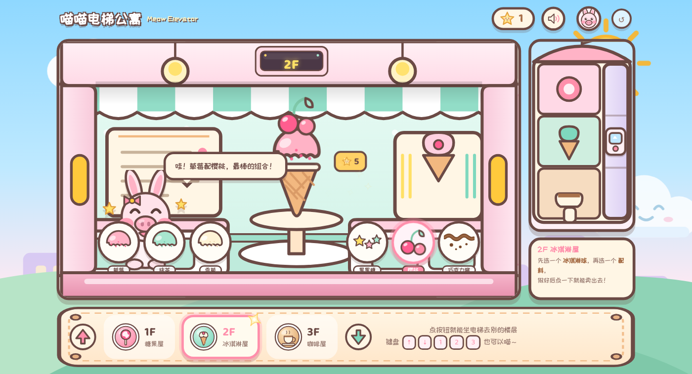
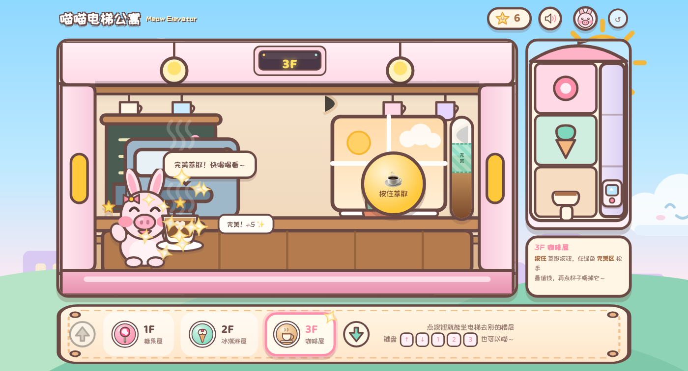
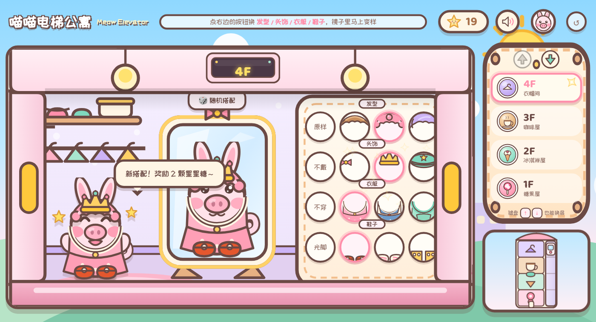
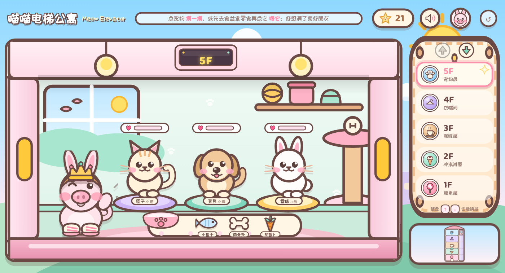
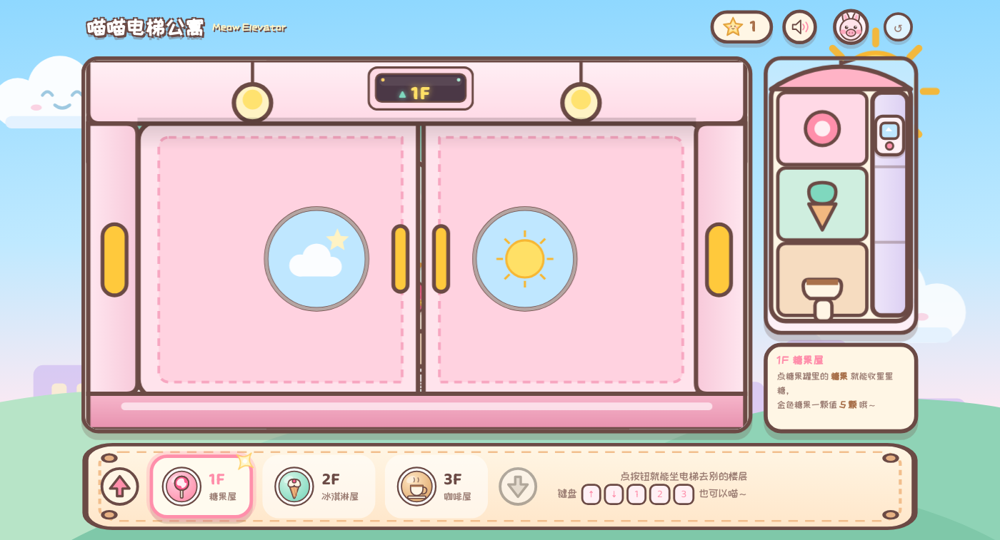
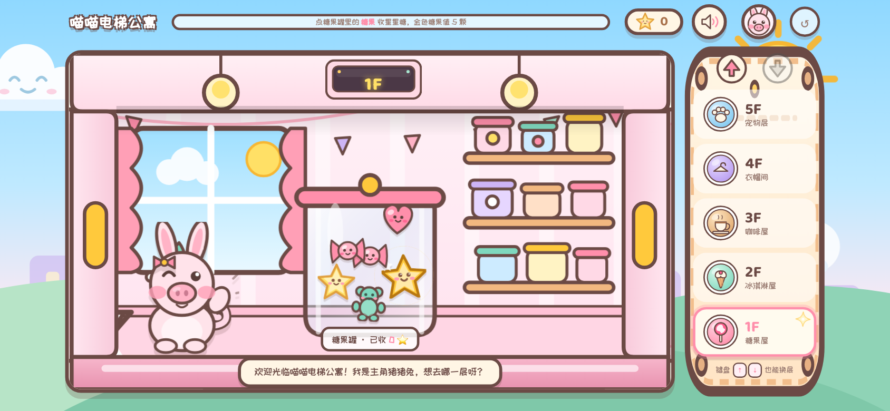
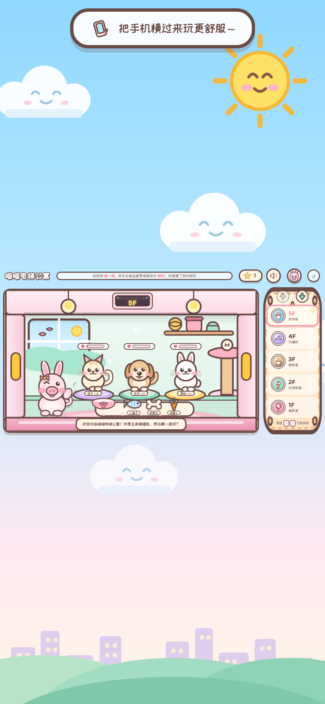

# 🐰🐷 喵喵电梯公寓 · Meow Elevator

🔗 **在线试玩**：<https://hydrogx.github.io/elevatorgame/>

一个可爱风的网页小游戏：坐电梯到不同楼层，每一层都是不同的小玩法。

- **1F 糖果屋**：点糖果罐里的糖果收星星糖，金色糖果一颗值 5 颗
- **2F 冰淇淋屋**：柜台前会来顾客**点单**（口味 + 配料），完全对上卖 **8 颗**，没对上只有 3 颗，卖完立刻换下一位顾客
- **3F 咖啡屋**：按住「萃取」按钮，在绿色完美区松手最值钱，再点杯子喝掉
- **4F 衣帽间**：换发型 / 头饰 / 衣服 / 鞋子，镜子里实时预览，凑出全新搭配还有星星糖奖励
- **5F 宠物层**：三只小宠物，摸摸 +1、喂对零食 +3，好感度攒满升级成「好朋友」还有奖励

主角是 **猪猪兔**（长兔耳 + 猪鼻子 + 胖脸颊），身上能穿 4 件可替换的部件；
HUD 上的小头像可以随时换成另一位角色 **猫猫咪咪**。两个角色各有 4 种表情、4 张独立 SVG。



| 2F 冰淇淋屋 | 3F 咖啡屋 | 4F 衣帽间 | 5F 宠物层 |
| --- | --- | --- | --- |
|  |  |  |  |

坐电梯时的样子（门关着，主角在门后打瞌睡）：



角色表情对照见 [docs/character-sheet.png](docs/character-sheet.png)，
所有可换装部件（发型 / 头饰 / 衣服 / 鞋子）的对位图见 [docs/outfit-parts.png](docs/outfit-parts.png)。

---

## 1. 怎么玩

| 操作 | 说明 |
| --- | --- |
| 点右侧楼层按钮 | 坐电梯去各层（**6F 在最上，1F 在最下**，跟真电梯一样；楼层多了会自动变成两列） |
| `↑` `↓` 键 | 上一层 / 下一层 |
| `1` ~ `6` 键 | 直接去对应楼层 |
| 1F 点糖果 | 收集星星糖（偶尔出现金糖果） |
| 2F 看顾客点单做冰淇淋 | 口味 + 配料都对上 = 8 颗星星糖，没对上 3 颗；卖完自动换下一位顾客 |
| 3F 按住萃取、再点杯子 | 在绿色完美区松手最值钱 |
| 4F 点圆按钮 | 换发型 / 头饰 / 衣服 / 鞋子；`🎲 随机搭配` 一键乱配 |
| 4F `🛍 商店` | 花星星糖买新衣服，也能买宠物装扮（点一下问价，再点一下买下来） |
| 4F 每行的 `‹ 1/2 ›` | 一行超过 4 件就翻页（每页 4 件，保证都完整显示不被柱子挡） |
| 4F `🐾 宠物装扮` | 给团子 / 豆豆 / 雪球挑饰品，买过的才能戴；装扮好去 5F 就能看到 |
| 5F 点宠物 / 先拿零食再点宠物 | 摸一摸 / 喂零食，好感度攒满会升级 |
| 6F 点三个摊位 | 玩小游戏赚星星糖：🏀 投篮、🏸 羽毛球、🎰 老虎机（**难度会自己跟着表现调**，见第 8 节） |
| HUD 小头像 | 切换主角形象（**猪猪兔 → 咪咪 → 小兔子 → 小马** 循环），**4F 镜子里的自己也会跟着换** |
| HUD 🧮（音量旁边） | **计算练习**：开启后每 3 分钟弹一道小学二年级数学题，必须在 10 秒内用屏幕数字键答对才能继续玩 |
| HUD 🔊 | 音效开关 |
| HUD ↺ | 清空进度重新开始 |

进度（星星糖、买过的商品、宠物装扮、做过的配方、穿过的搭配、宠物好感度、当前楼层、主角形象）都会自动存在浏览器 localStorage 里，
存档键名：`meow-elevator-save-v1`。

---

## 2. 怎么运行

**最简单**：直接双击 `index.html`（本游戏只用普通 `<script>`，不需要打包工具）。

**推荐**：双击 `start.command`（macOS），会在 `http://127.0.0.1:8123/` 起一个本地服务器并打开浏览器。
或者自己起：

```bash
python3 -m http.server 8123 --bind 127.0.0.1
# 然后浏览器打开 http://127.0.0.1:8123/index.html
```

环境要求：任意现代浏览器（Chrome / Edge / Safari / Firefox 均可）。无需安装任何依赖。

---

## 3. 目录结构（每个资源都是独立文件，方便单独修改）

```
elevatorgame/
├── index.html                  # 页面骨架（只有结构，没有逻辑）
├── start.command               # 一键启动脚本
├── fonts/
│   ├── ZCOOLKuaiLe-Regular.ttf # 可爱中文字体（站酷快乐体）
│   └── Baloo2.ttf              # 可爱数字/英文字体
├── styles/
│   ├── base.css                # 配色变量、字体、整体画布缩放
│   ├── layout.css              # 舞台 + 右侧按键面板 + 底部楼层指示条的布局
│   ├── elevator.css            # 电梯门 / 轿厢 / 显示屏 / 主角 / 按键面板（含两列排布）
│   ├── floors.css              # 各楼层各自的可交互道具（4F 换装、5F 宠物、宠物装扮图层）
│   ├── arcade.css              # 6F 三个小游戏的弹窗与版面
│   ├── shop.css                # 4F 商店 + 宠物装扮面板
│   ├── math.css                # 计算练习弹窗 + HUD 上的计算器按钮
│   ├── animations.css          # 所有关键帧动画
│   ├── backdrop.css            # 窗口外那圈天空装饰
│   └── mobile.css              # ★ 手机 / 触屏适配（热区放大、禁粘 hover、竖屏提示）
├── js/
│   ├── core/
│   │   ├── config.js           # ★ 资源清单 + 楼层配置 + 各种数值
│   │   ├── state.js            # 存档（星星糖 / 进度 / 换装 / 宠物好感 / 设置）
│   │   ├── audio.js            # 音效与 BGM 播放
│   │   ├── fx.js               # 飘字、闪光、光圈
│   │   ├── dialogue.js         # 主角表情 + 对话气泡
│   │   ├── outfit.js           # ★ 换装系统（身体 + 4 个可换图层）
│   │   ├── petwear.js          # ★ 宠物装扮（任意宠物叠一件饰品，5F/6F/面板同步）
│   │   ├── shop.js             # ★ 4F 商店 + 宠物装扮面板（商品清单直接从 config 推导）
│   │   ├── math.js             # ★ 计算练习（出题 / 倒计时 / 数字键盘 / 开关）
│   │   └── elevator.js         # 电梯运行流程（关门→走→叮→开门）
│   ├── floors/
│   │   ├── registry.js         # 楼层玩法注册表
│   │   ├── candy.js            # 1F 糖果屋玩法
│   │   ├── icecream.js         # 2F 冰淇淋屋玩法
│   │   ├── coffee.js           # 3F 咖啡屋玩法
│   │   ├── closet.js           # 4F 衣帽间玩法（含商店 / 宠物装扮入口）
│   │   ├── pet.js              # 5F 宠物层玩法
│   │   └── arcade.js           # 6F 游乐区玩法（三个小游戏）
│   └── main.js                 # 启动、面板交互、楼层切换
├── assets/
│   ├── character/              # ★ 四位主角表情（猪猪兔 / 咪咪 / 小兔子 / 小马，各 4 张）
│   ├── closet/                 # ★ 可换装部件：发型 / 头饰 / 衣服 / 鞋子（各 4 件，最后一件要买）
│   ├── pets/                   # ★ 5F 宠物（3 只 × 待机/开心）+ 3 样零食 + 食盆 + 4 件宠物饰品
│   ├── arcade/                 # ★ 6F 小游戏道具（篮球、篮筐、羽毛球、球拍）
│   ├── customers/              # ★ 2F 顾客（小熊 / 小狐 / 企鹅，各一张）
│   ├── rooms/                  # 六层楼的房间背景（1200×675）
│   ├── elevator/               # 门、轿厢框、楼层按钮、竖排面板底板、显示屏、轿厢标记
│   ├── items/                  # 糖果、冰淇淋球、配料、咖啡杯…每个一件
│   ├── ui/                     # 星星糖币、心形、闪光、音效图标、头像、站点图标
│   ├── bg/                     # 天空、太阳、云、远景城市、山丘
│   └── audio/                  # 13 个 wav（音效 + 循环 BGM）
└── tools/                      # 开发用的小工具（不参与游戏运行）
    ├── generate_audio.py       # 用 Python 标准库合成所有音效/BGM
    ├── smoke.mjs               # 无头 Chrome 自动点一遍的自检脚本
    ├── mobile-check.mjs        # 手机适配自检（横屏 / 竖屏 / 平板，检查热区与遮挡）
    ├── build-asset-preview.mjs # 生成所有 SVG 资源总览页
    ├── asset-preview.html      # 资源总览（上面那个脚本生成的）
    ├── character-sheet.html    # 角色表情对照表
    └── outfit-preview.html     # 换装部件对位预览（改完衣服用它检查有没有错位）
```

---

## 4. 想改东西，改哪里？

| 想改什么 | 改这里 |
| --- | --- |
| **主角形象 / 表情** | `assets/character/<角色>-{idle,happy,wave,sleep}.svg` + `assets/ui/avatar-<角色>.svg`（四位主角共用 300×350 骨架，所以**换装图层四个人都能穿**） |
| **给 4F 加一件新衣服 / 新发型** | 在 `assets/closet/` 里加一张 300×350 的 SVG（照着现成的改最省事），再到 `js/core/config.js` 的 `closet.items` 里加一项（`EG.ASSETS.closet` 里同步加路径）；带 `price` 就变成商店商品 |
| **加一件「某位主角专属」的服装** | 在 `config.closet.items` 的那一项里加上 `skin: 'pony'`（主角 id），别人穿上会自动脱掉、换装行里会压灰并标出是哪位主角 |
| **计算练习的节奏 / 难度** | `js/core/config.js` 的 `math` 段：`everyMs`（多久出一道，默认 3 分钟）、`limitMs`（几秒换题，默认 10 秒）、`maxAdd` / `maxMul`（数字范围） |
| **加一件宠物饰品** | 在 `assets/pets/` 里加一张 200×190 的 SVG（和宠物同画布就自动对齐），再到 `js/core/config.js` 的 `petwear.items` 和 `EG.ASSETS.petwear` 里各加一项；取景在 `styles/shop.css` 的 `.pw--*` |
| **商店 / 宠物装扮弹窗的外观** | `styles/shop.css`（商品卡片、装扮行） |
| 换装部位的位置 / 缩放取景 | 身体比例在 SVG 里（同一画布就自动对齐）；按钮取景在 `styles/floors.css` 的 `.garment--*` |
| 4F 每行选项的位置 | `js/core/config.js` 的 `closet.rows`（百分比） |
| 换装奖励 / 默认穿着 | `js/core/config.js` 的 `closet.comboBonus` 和 `closet.defaultOutfit` |
| **加一位 2F 顾客** | 在 `assets/customers/` 放一张 SVG（画布 200×250），再到 `js/core/config.js` 的 `icecream.customers` 和 `EG.ASSETS.customers` 里各加一项 |
| 2F 的奖励数值 | `js/core/config.js` 的 `icecream.base`（没对上）和 `icecream.match`（对上） |
| 2F 顾客 / 点单气泡的位置 | `styles/floors.css` 的 `.customer` 和 `.order` |
| **加一只 5F 新宠物** | 在 `assets/pets/` 放一对图（`xxx-idle.svg` + `xxx-happy.svg`，画布 200×190），再在 `js/core/config.js` 的 `pets.list` 和 `EG.ASSETS.pets.list` 里各加一项（含位置 `x` 和爱吃的零食 `food`） |
| 宠物的好感度 / 奖励数值 | `js/core/config.js` 的 `pets` 段（每摸一下加多少、升级门槛、升级奖励…） |
| 5F 宠物和零食的位置 | `js/core/config.js` 的 `pets.petBottom` / `bowlLeft` / `foodLeft` / `foodBottom` |
| **加一层新楼层（比如 7F）** | ① `assets/rooms/` 放房间图 ② `assets/elevator/button-7f.svg` 放按钮图 ③ `js/core/config.js` 的 `floors` 数组加一项（`room`/`button`/`tip`/`lines`）④ `index.html` 面板最前面插一个按钮（**楼层指示条和两列排布都是自动的**）⑤ 抄 `js/floors/pet.js` 写一个新玩法文件并挂上 |
| **楼层按键（顺序 / 大小 / 高亮 / 两列）** | `index.html` 里的 `.panel` 段（顺序就是 DOM 顺序，最高层在最前）+ `styles/elevator.css` 的 `.panel` / `.floorbtn` / `body.panel-2col`；几层起用两列改 `config.panel.twoColumnAt` |
| **楼层指示条** | 格子由 `js/main.js` 按 `floors` 自动生成，样式在 `styles/layout.css` 的 `.floors*` |
| **商店卖什么 / 卖多少钱** | 在 `js/core/config.js` 的 `closet.items` 或 `petwear.items` 里给商品加 `price` 就会出现在商店（**不写 price 就是免费的**）；商品清单是自动推导的，不用另外登记 |
| 按键面板的底板花纹 | `assets/elevator/panel-plate-v.svg` |
| 换默认主角 | `js/core/config.js` 里的 `defaultSkin`（`pigbunny` / `cat` / `rabbit` / `pony`） |
| **新增一位主角** | `assets/character/新名字-{idle,happy,wave,sleep}.svg` 放 4 张 + `assets/ui/avatar-新名字.svg`，再在 `EG.ASSETS.character` 和 `EG.CONFIG.skins`（名字 + 开场白）里各加一项；HUD 头像是按 `EG.ASSETS.character` 的键自动循环的 |
| **某一层的房间样子** | `assets/rooms/room-candy.svg` / `room-icecream.svg` / `room-coffee.svg` / `room-closet.svg` / `room-pet.svg` / `room-arcade.svg`（画布 1200×675） |
| 某一层的玩法道具 | `assets/items/`、`assets/closet/`、`assets/pets/` 里对应的 SVG（每件一个文件） |
| 道具在房间里的位置 / 大小 | `styles/floors.css`（坐标是百分比，对应 1200×675 原稿） |
| 楼层名字 / 提示文案 / 台词 | `js/core/config.js` 的 `floors` 数组 |
| 玩法数值（糖果分值、冰淇淋售价、咖啡区间、宠物好感、小游戏奖励） | `js/floors/candy.js`、`icecream.js`、`coffee.js`、`pet.js`、`arcade.js` 顶部常量 / `config.pets` / `config.arcade` |
| **6F 三个小游戏的难度与奖励** | `js/core/config.js` 的 `arcade` 段：`baseSpeed`（第 1 档速度）、`step`（每档加快多少）、`zones`（各档命中窗口）、`upStreak` / `downStreak`（几连中升档 / 几次没成绩降档）、老虎机赔率 |
| **6F 加第四个小游戏** | 在 `js/floors/arcade.js` 里写一个 `startXxx()`，往 `GAMES` 和 `config.arcade.list` 各加一项（房间图里再画个摊位） |
| **整体配色** | `styles/base.css` 顶部的 `:root` 变量（`--c-pink`、`--c-mint`…） |
| 电梯开关门速度 | `js/core/config.js` 的 `elevator` 段 |
| **音效 / BGM** | 直接替换 `assets/audio/*.wav`；想重新合成改 `tools/generate_audio.py` 后运行 `python3 tools/generate_audio.py` |
| 字体 | 换掉 `fonts/` 里的 ttf，并同步 `styles/base.css` 的 `@font-face` 与 `--font-cute` |
| 全部资源路径 | `js/core/config.js` 的 `EG.ASSETS`（统一清单，改路径只改这一处） |

> 坐标小抄：房间原稿是 **1200×675**，舞台上按 **0.84** 显示（1008×567）。
> 道具用百分比定位，所以 `left: 50%` 就是原稿 x=600 的位置。

---

## 5. 开发者自检工具

```bash
# 1) 起一个带调试端口的无头 Chrome（会自动跑本目录的 index.html）
"/Applications/Google Chrome.app/Contents/MacOS/Google Chrome" \
  --headless=old --disable-gpu --no-sandbox --remote-debugging-port=9333 \
  --user-data-dir="$PWD/.chrome-cdp" --window-size=1400,900 \
  "file://$PWD/index.html" &

# 2) 自动点一遍五层玩法，截图存到 /tmp/eg-shots，并报告页面报错
node tools/smoke.mjs
```

`tools/smoke.mjs` 一共 119 项检查（**每次都会先清空存档再刷新**，保证结果不受上一次进度影响）：
按键竖排顺序、糖果能加星星糖、电梯关门/开门、房间切换、
**2F 顾客点单（照着做卖 8 颗 / 做错了只卖 3 颗 / 卖完换顾客）**、咖啡萃取到完美区、喝咖啡收钱、
**4F 换装同时更新主角与镜子 / 新搭配奖励 / 换装存档**、
**5F 摸宠物加钱、喂对零食加更多、喂错不给钱、好感度升级奖励、宠物存档**、以及**页面零报错**。

在浏览器里直接打开这几个页面可以肉眼检查美术资源：

- `tools/asset-preview.html` —— 所有 SVG 资源总览（`node tools/build-asset-preview.mjs` 重新生成）
- `tools/character-sheet.html` —— 两个角色的全部表情对照
- `tools/outfit-preview.html` —— 换装部件对位预览（改完衣服先用它检查有没有错位）

手机上还想再确认一遍的话：

```bash
# 用 Chrome 的设备模拟分别按横屏手机 / 竖屏手机 / 平板跑一遍
node tools/mobile-check.mjs
```

它会断言：触屏样式有没有生效、**奖励/台词气泡有没有压住任何一个可点元素**、
最小的按钮在真实屏幕上有没有 ≥40px、竖屏提示条会不会出现/收起。

---

## 6. 手机 / 触屏适配

游戏本来是按 **16:9 横屏**设计的（1280×680），手机上做了这些处理：

| 场景 | 处理 |
| --- | --- |
| 触屏设备 | 自动放大可点区域：最小热区 **≥40px**（糖果这种小东西用内边距撑热区，图不变大） |
| 触屏设备的右栏 | 隐藏小地图（纯装饰），把高度全让给 5 个楼层按钮，按钮变得又大又好点 |
| 触屏设备的 hover | 全部禁用「粘住」的 hover，只保留 `:active` 按下反馈 |
| 竖屏手机 | 顶部浮出一条「把手机横过来玩更舒服」提示（点一下收起），游戏本体仍可正常玩 |
| 手机地址栏 | 用 `visualViewport` 算尺寸，地址栏收起/展开、转屏后都会重新居中缩放 |
| 刘海屏 | 处理 `safe-area-inset`，不会顶到刘海或底部小黑条 |
| 双击缩放 | `touch-action: manipulation` + `maximum-scale=1`，不会误触发放大 |

**提示不会挡住操作**，这是特意设计的：

- 主角的台词/奖励气泡固定在**舞台最底下的门槛那一条**（那里没有任何可点道具，
  并且底部元素（糖果最低点、罐子标签、零食那排）都往上让开了位置）
- 飘字（`+8` 之类）只往上飘很短一段、同时最多 5 个、0.9 秒消散，位置就在被点的元素上方
- 气泡和飘字都是 `pointer-events: none`，就算视觉上叠到了也不会吃掉点击

| 横屏手机 | 竖屏手机（会有横屏提示） |
| --- | --- |
|  |  |

---

## 7. 计算练习（家长模式）

HUD 上音量键右边那个 🧮 按钮就是开关（状态存在存档里，下次打开还是上次的设置）。

| 行为 | 说明 |
| --- | --- |
| 开启后 | 每 **3 分钟**弹一道题（`config.math.everyMs`），弹窗期间点不到游戏，必须答对 |
| 题目 | 小学二年级水平：表内乘除法范围内的 `a × b ± c`（如 `5 × 4 + 8`）、两位数加减 |
| 回答 | **屏幕上点数字键**（也可以直接用键盘数字键 + 退格），输入栏实时显示 |
| 答对 | 弹窗消失、恢复游戏，重新开始 3 分钟计时 |
| **10 秒没答出来** | 自动**换一道新题**、倒计时重置，弹窗不消失（`config.math.limitMs`） |
| 答错 | 输入框抖一下并清空，题目和计时都继续 |
| 关闭开关 | 弹窗立刻消失、不再计时 |

想调难度就改 `js/core/config.js` 的 `math` 段（`maxAdd`、`maxMul`），
想改成 1 分钟一道就把 `everyMs` 改成 `60000`。

---

## 8. 6F 小游戏的难度（面向 5-8 岁）

默认就是**最慢的第 1 档**，并且会跟着小朋友的表现自己调：

| 游戏 | 第 1 档 | 升档条件 | 降档条件 | 共几档 |
| --- | --- | --- | --- | --- |
| 🏀 投篮 | 指针一个来回约 **1.9 秒**，完美区 ±16% | 连续中 **3** 球 | 连续 **2** 球没进 | 5 |
| 🏸 羽毛球 | 球飞到你这边约 **1.7 秒**（旧版 0.9 秒） | 同一回合连击 **4** 次 | 连续 **2** 次没接到 | 5 |

- 每升一档：速度 +16~18%，**同时命中窗口变窄**（投篮的绿色区域会一起变，所见即所得）
- 每降一档：速度变慢、窗口变宽，最低档会停在第 1 档并给一句鼓励
- 档位记在存档 `gameLevel` 里，弹窗标题旁边能看到 `速度 ★★☆☆☆`
- 🎰 老虎机是纯运气，不参与难度调节

想整体调难度：改 `js/core/config.js` 的 `arcade.basket` / `arcade.badminton`
（`baseSpeed` 第 1 档速度、`step` 每档增幅、`zones` 各档窗口、`upStreak` / `downStreak`）。

---

## 9. 已知小细节

- 房间、道具、角色全是手写 SVG，可以无限放大不糊；想换成位图（PNG）也可以，直接替换同名文件并保持同样比例即可。
- 音效全部是脚本合成的（没有任何版权素材），BGM 是一段 19 秒的循环小曲。
- 电梯行进时主角会躲到门后打瞌睡（门关着看不见房间和道具，这是故意的）。
- 游戏画面固定 1280×680 设计稿，等比缩放居中，所以窗口任意大小都不会错位。
- 右侧控制面板是**竖排**的：5F 在最上、1F 在最下（DOM 顺序即显示顺序，想加楼层就往最前面插一个按钮）。
- **换装是「图层叠加」**：身体（含 4 种表情）是一层，发型 / 头饰 / 衣服 / 鞋子各一层，
  全部共用 300×350 画布，所以换表情也不会错位；猫猫咪咪没有对应部件，所以穿衣服时会看不到（镜子里照常显示）。
- **5F 宠物**同理：每只宠物一对图（待机 / 开心），点一下临时换成开心表情，好感度和等级存在存档里，
  每只最高 2 级（★ 好朋友 → ★★ 最好朋友）。
- **四位主角共用同一套 300×350 骨架**（小兔子、小马、猫猫咪咪都是照猪猪兔的骨架画的，只改五官和毛色），
  所以 4F 的换装图层、商店买来的衣服，**四个人都能穿**、舞台和镜子里都会同步。
  （早期版本猫猫是另一套体型、衣服图层被整层隐藏，换装看不到变化，现在已经统一了。）
- **6F 小游戏会自适应难度**（面向 5-8 岁）：默认从**第 1 档（最慢）**开始，
  **连续 2 次没成绩就降一档**（指针/球变慢、命中窗口变宽），**连续过关就升一档**，共 5 档。
  档位写在存档里（`gameLevel`），所以小朋友下次打开还是他习惯的速度；弹窗标题旁边有 `速度 ★★☆☆☆` 可以看当前档位。
- **4F 换装每行分页**：房间选项板内框到右侧电梯柱子之间只有约 280px 可用（放不下 5 个 66px 圆按钮），
  所以每页最多 4 件，超过就出现 `‹ 1/2 ›` 翻页（`js/floors/closet.js` 的 `PER_PAGE`）。
  每页的按钮大小仍会按数量微调，触屏的放大倍数也算进公式，保证永远完整落在选项板里。
- **专属服装**：`config.closet.items` 里写了 `skin: 'pony'` 的道具只有小马能穿；
  以别的主角打开 4F 时它会压灰并在角上标出那位主角的小头像，点了会提示去换人；
  换人时穿不了的专属会自动“脱掉”（图层隐藏，搭配本身还留在存档里，换回来就还在）。
- **4F 商店是「配置驱动」的**：`config.closet.items` / `config.petwear.items` 里凡是写了 `price` 的条目，
  会自动出现在商店里（不写 `price` 就是免费的默认款）；买过的记在存档 `owned` 里，
  换装面板和宠物装扮面板里没买的会显示 🔒 + 价格，点第一次问价、点第二次才扣钱。
- **宠物装扮**是一张 200×190 的饰品图叠在宠物同尺寸画布上，所以任意宠物都能戴；
  5F 的宠物、6F 小游戏里出场的宠物、装扮面板里的预览共用同一份数据（改完 4F 去 5F 就能看到）。
- **换主角时 4F 镜子里的自己也会跟着换**（角色和表情都同步），猫猫没有对应的衣服部件，所以镜子里会自动不穿。
- 买完衣服会立刻穿上，而「第一次穿出这套搭配」还有 2 颗星星糖奖励，
  所以商店里买 15 颗的头发，余额会只少 13（这是故意的，不是算错）。
- **楼层按钮到 6 层会自动排成两列**（6F 5F / 4F 3F / 2F 1F，高楼层依然在上一排），
  层数门槛在 `config.panel.twoColumnAt`；原来的「楼房剖面小地图」楼层多了竖着放不下，
  换成了右栏底部的**横向楼层指示条**（格子由配置自动生成，轿厢停在当前层）。
- **CSS 动画会整个覆盖 `transform`**：靠 `translate(-50%,-50%)` 居中的元素（比如糖果）如果直接套
  `bob` 这种只写 `translateY` 的关键帧就会跑偏，所以另外准备了 `bobc`（完全居中）和 `bobx`（只横向居中）两条关键帧。

---

## 10. 部署到 GitHub Pages

整站是纯静态、零依赖、全相对路径，**构建产物就是源码本身**，
所以直接把整个文件夹推上去就能玩，不需要任何构建步骤。

### 方式 A：用仓库里已经放好的 GitHub Actions 工作流（推荐）

`.github/workflows/deploy.yml` 已经写好了，你只需要三步：

```bash
# 1) 先在 GitHub 网页上建一个空仓库（不要勾选 Add README）

# 2) 本地推上去（脚本会自动 init / commit / 加 remote / push）
tools/deploy.sh git@github.com:你的用户名/elevatorgame.git

# 3) 到仓库 Settings → Pages → Source 选 “GitHub Actions”
#    等 Actions 跑完，访问 https://你的用户名.github.io/elevatorgame/
```

### 方式 B：不用 Actions，直接从分支发布

```bash
tools/deploy.sh git@github.com:你的用户名/elevatorgame.git
# 然后 Settings → Pages → Source 选 “Deploy from a branch” → main → / (root)
```

方式 A 每次 `git push` 会自动重新部署；方式 B 概念更少。
（`.nojekyll` 已经放好了，GitHub 不会对文件做任何 Jekyll 处理。）

### 部署后要注意的两件小事

- **路径全是相对的**，所以放在 `用户名.github.io/任意子路径/` 下都能正常工作，
  以后绑自定义域名、改路径都不用动代码。
- **存档**用的是浏览器 `localStorage`，换域名/换路径等于换了一份新存档，这是正常的。

### 如果你本地没有 git 环境

在仓库网页上 `Add file → Upload files`，把整个文件夹拖进去也行（注意保持目录结构）。
